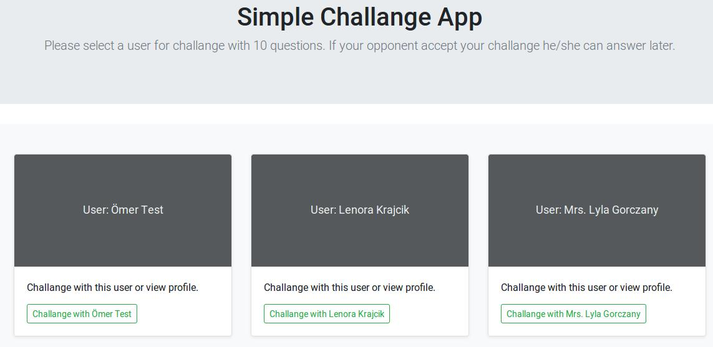
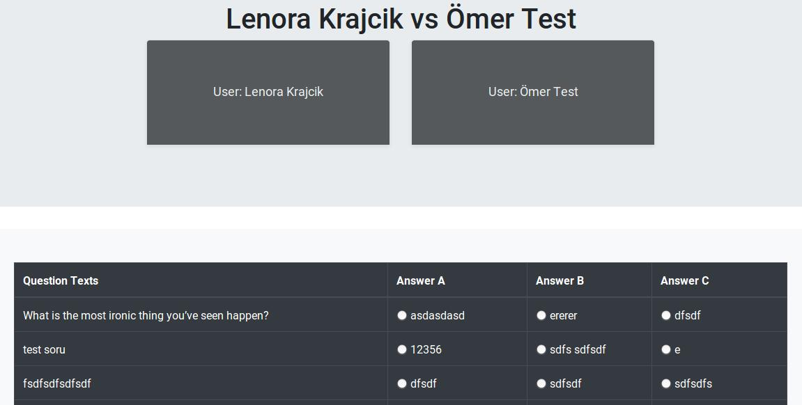
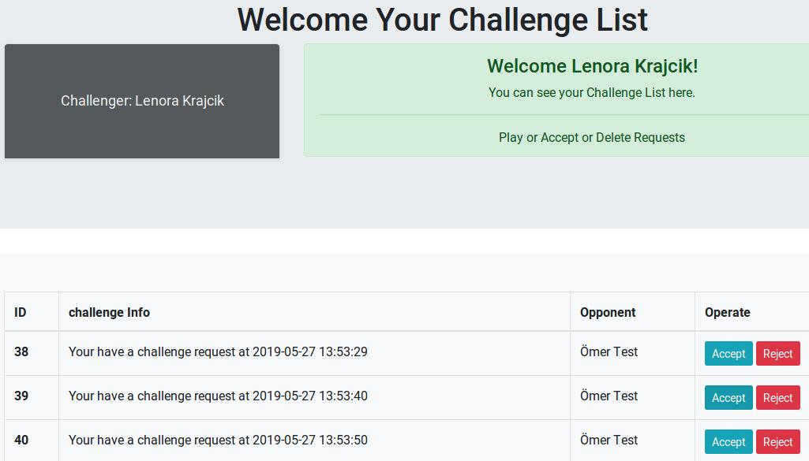
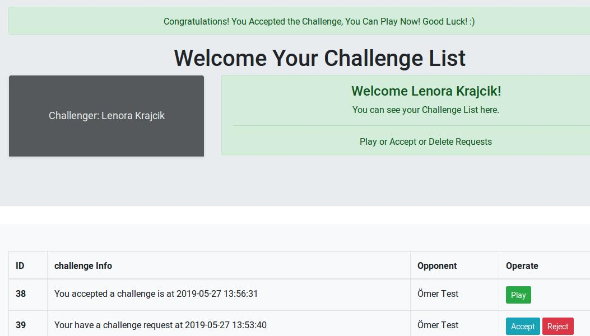
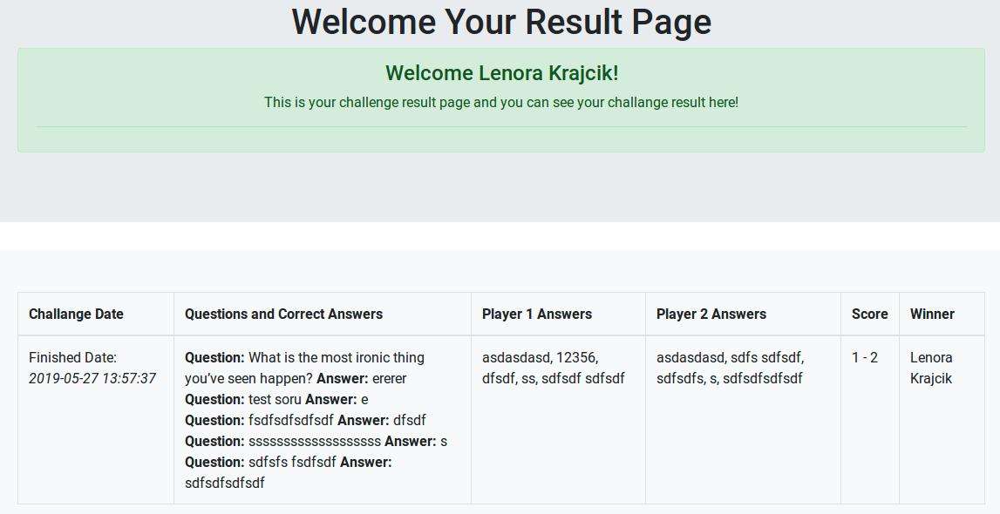

# Challenge with Laravel

Challenge app with Laravel. 

# Getting started

## Installation

Please check the official laravel installation guide for server requirements before you start. [Official Documentation](https://laravel.com/docs/5.8/installation#installation)

Clone the repository

    `git clone https://gitlab.com/omeripek/challengeapp.git`

Switch to the repo folder

    `cd challengeapp`

Install all the dependencies using composer

    `composer install`

Copy the example env to .env file

    `cp .env.example .env`

Generate a new application key

    `php artisan key:generate`

Run the database migrations (**Set the database connection in .env before migrating**)

    `php artisan migrate`

Run seeders

    `php artisan db:seed`

Start the local development server

    `php artisan serve`

You can now access the server at http://localhost:8000

# Demo admin user info

- email: test@test.com
- password: 123456

# Packages

## Dependencies

- [Laravel-Modules](https://github.com/nWidart/laravel-modules) - For large Laravel app using modules.
- [laravel-permission](https://github.com/spatie/laravel-permission) - For Associate users with permissions and roles
- [faker](https://github.com/fzaninotto/Faker) - Generate random data
- [Question Module](https://github.com/omeripek/question) - Generate random data

----------
 
# To do list!

## for new verions

- [x] Setting for permission and auth all pages
- [x] Update challenge module
- [x] Update question module
- [x] Update admincp module
- [ ] Security update
- [x] Change list tables like user challenge list page
- [x] Add new game pages for users 
- [x] Archive for users, challenges or the other activities
- [ ] Fix bugs
- [ ] Add general settings
- [ ] Add new features
- [ ] Update front-end

----------
 
# Screenshots
 

----------